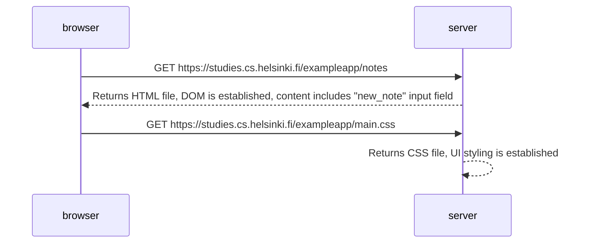

```mermaid
sequenceDiagram
    participant browser
    participant server

    browser->>server: GET https://studies.cs.helsinki.fi/exampleapp/notes
    server-->>browser: Returns HTML file, DOM is established, content includes "new_note" input field

    browser->>server: GET https://studies.cs.helsinki.fi/exampleapp/main.css
    server-->>server: Returns CSS file, UI styling is established

    
```
