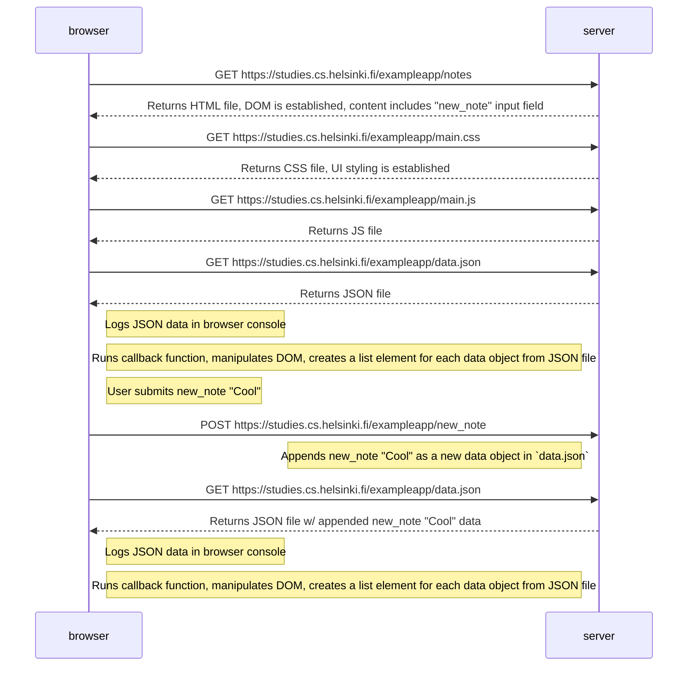

```mermaid
sequenceDiagram
    participant browser
    participant server

    browser->>server: GET https://studies.cs.helsinki.fi/exampleapp/notes
    server-->>browser: Returns HTML file, DOM is established, content includes "new_note" input field

    browser->>server: GET https://studies.cs.helsinki.fi/exampleapp/main.css
    server-->>browser: Returns CSS file, UI styling is established

    browser->>server: GET https://studies.cs.helsinki.fi/exampleapp/main.js
    server-->>browser: Returns JS file
    browser->>server: GET https://studies.cs.helsinki.fi/exampleapp/data.json
    server-->>browser: Returns JSON file
    note right of browser: Logs JSON data in browser console
    note right of browser: Runs callback function, manipulates DOM, creates a list element for each data object from JSON file

    note right of browser: User submits new_note "Cool"
    browser->>server: POST https://studies.cs.helsinki.fi/exampleapp/new_note
    note left of server: Appends new_note "Cool" as a new data object in `data.json`
    browser->>server: GET https://studies.cs.helsinki.fi/exampleapp/data.json
    server-->>browser: Returns JSON file w/ appended new_note "Cool" data
    note right of browser: Logs JSON data in browser console
    note right of browser: Runs callback function, manipulates DOM, creates a list element for each data object from JSON file
```
