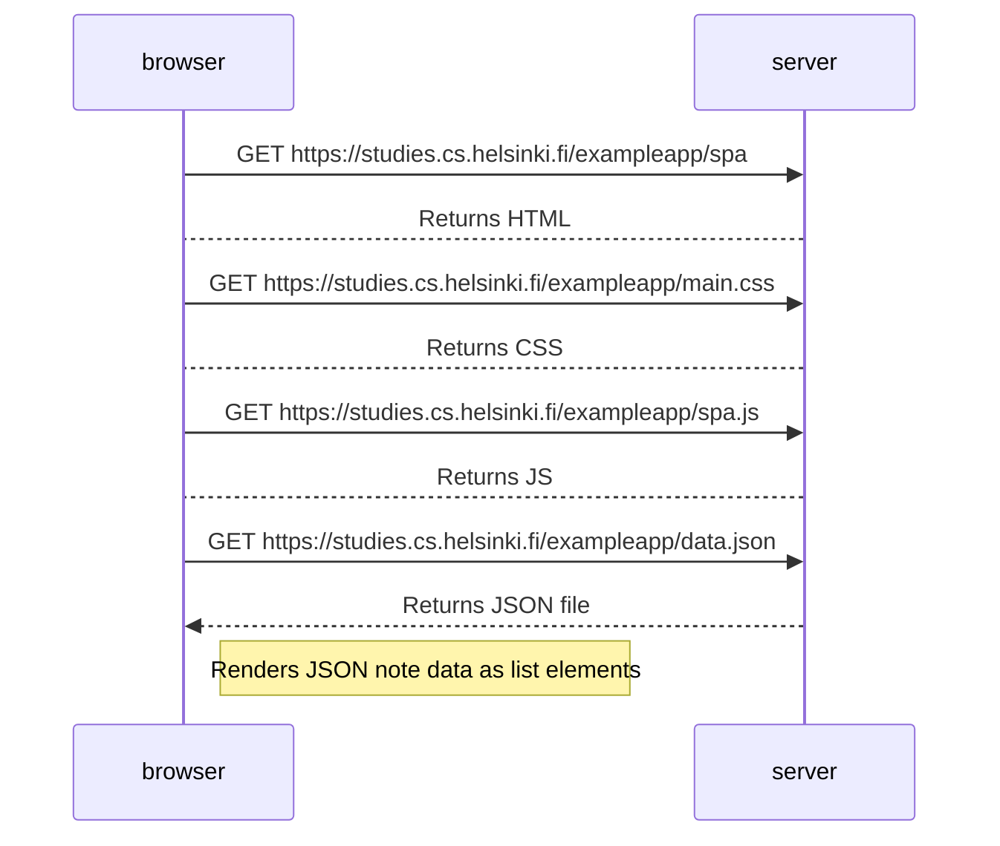

```mermaid
sequenceDiagram
    participant browser
    participant server

    browser->>server: GET https://studies.cs.helsinki.fi/exampleapp/spa
    server-->browser: Returns HTML
    browser->>server: GET https://studies.cs.helsinki.fi/exampleapp/main.css
    server-->browser: Returns CSS
    browser->>server: GET https://studies.cs.helsinki.fi/exampleapp/spa.js
    server-->browser: Returns JS
    browser->>server: GET https://studies.cs.helsinki.fi/exampleapp/data.json
    server-->>browser: Returns JSON file
    note right of browser: Renders JSON note data as list elements
```
